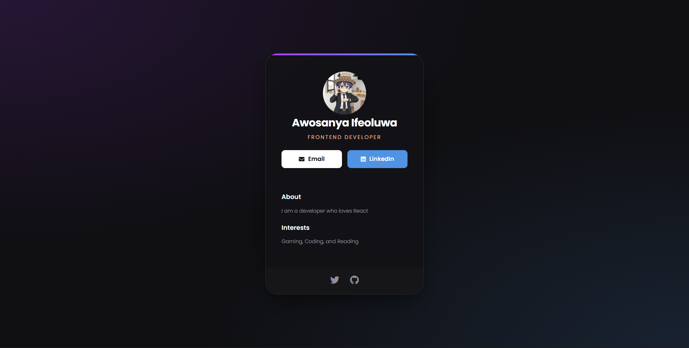
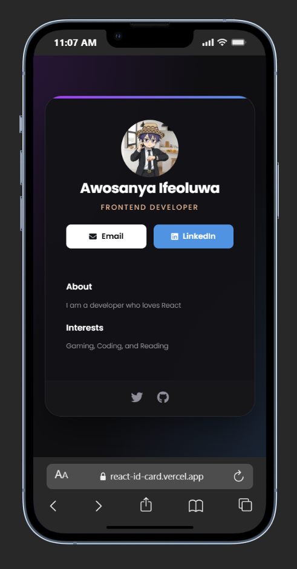

# Digital Business Card

A sleek, premium, and responsive digital business card built with **React** and **Vite**. This project features glassmorphism design, professional typography, and high-end SCSS styling.

## Live Demo

**Check out the live site here:** [https://react-id-card.vercel.app/]

---
## Screenshots



---

##  Features

* **High-End Design:** Utilizes glassmorphism, radial gradients, and subtle glow effects for a premium feel.
* **Responsive Layout:** Fully optimized for mobile, tablet, and desktop viewing.
* **Modern Tech Stack:** Built with Vite for lightning-fast development and optimized production builds.
* **Aesthetic Typography:** Integrated with Google Fonts (Poppins) for a professional look.
* **Accessible UI:** Semantic HTML5 and clean component architecture.

---

## 🛠️ Tech Stack

* **Framework:** [React.js](https://reactjs.org/)
* **Build Tool:** [Vite](https://vitejs.dev/)
* **Styling:** [SCSS / SASS](https://sass-lang.com/)
* **Icons:** [Font Awesome](https://fontawesome.com/)
* **Deployment:** [Vercel](https://vercel.com/)

---

## 📂 Project Structure

```text
├── public/              
├── src/
│   ├── assets/          
│   │   └── Screenshot/      
│   ├── components/      
│   │   ├── Info.jsx
│   │   ├── About.jsx
│   │   ├── Interests.jsx
│   │   └── Footer.jsx
│   ├── App.jsx          
│   ├── main.jsx         
│   └── index.scss       
├── index.html           
├── package.json         
└── vite.config.js

```

---

## ⚙️ Local Setup

To run this project on your local machine, follow these steps:

1. **Clone the repository:**
```bash
git clone https://github.com/your-username/your-repo-name.git

```


2. **Navigate into the project directory:**
```bash
cd your-repo-name

```


3. **Install dependencies:**
```bash
npm install

```


4. **Start the development server:**
```bash
npm run dev

```


5. **Open your browser:**
Navigate to `http://localhost:5173` to see the magic!

---

## 📝 Author

**Awosanya Ifeoluwa**

* Frontend Developer
* [LinkedIn](https://www.linkedin.com/in/awosanya-ifeoluwavictor/)
* [GitHub](https://github.com/viipzy)

---
